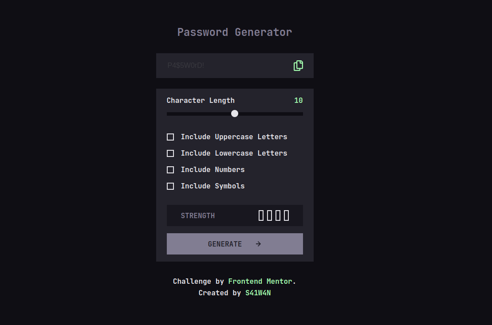

# Frontend Mentor - Password Generator App Solution

This is a solution to the [Password generator app challenge on Frontend Mentor](https://www.frontendmentor.io/challenges/password-generator-app-Mr8CLycqjh). Frontend Mentor challenges help you improve your coding skills by building realistic projects.

## Table of contents

- [Overview](#overview)
  - [The challenge](#the-challenge)
  - [Screenshot](#screenshot)
  - [Links](#links)
  - [Built with](#built-with)
  - [Useful resources](#useful-resources)

## Overview

### The challenge

Users should be able to:

- Generate a password based on the selected inclusion options
- Copy the generated password to the computer's clipboard
- See a strength rating for their generated password
- View the optimal layout for the interface depending on their device's screen size
- See hover and focus states for all interactive elements on the page

### Screenshot

### Links

- [Solution URL](https://github.com/s31w4n/password-generator)
- [Live Site URL](https://s31w4n-password-generator.vercel.app)

### Built with

- Semantic HTML5 markup
- CSS custom properties
- Flexbox
- CSS Grid
- Desktop-first workflow
- Typescript
- Tostify-js
- [Vite](https://vitejs.dev/)

### Useful resources

Formula for calculating password strength

- [Subham Datta at Baeldung](https://www.baeldung.com/cs/password-entropy)
- [Walt Powell on Linkedin](https://www.linkedin.com/pulse/math-based-approach-password-strength-walt-powell-cissp-cism?trk=public_profile_article_view)

Styling the custom checkboxes

- [Stephanie Eckles at Modern CSS](https://moderncss.dev/pure-css-custom-checkbox-style/)
